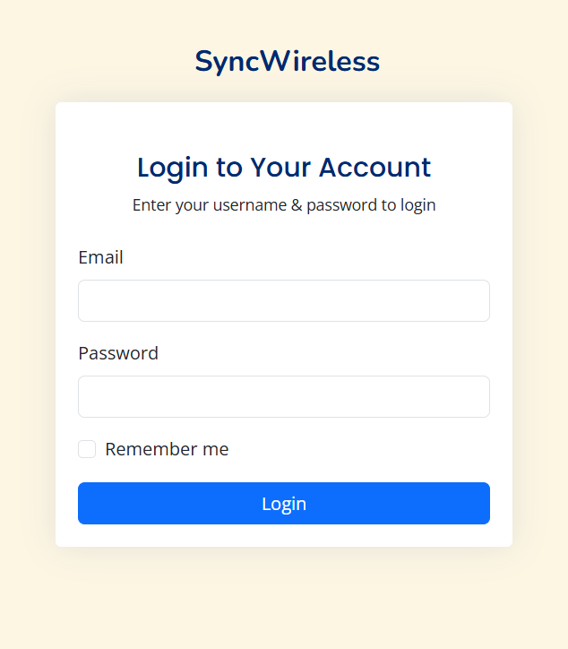
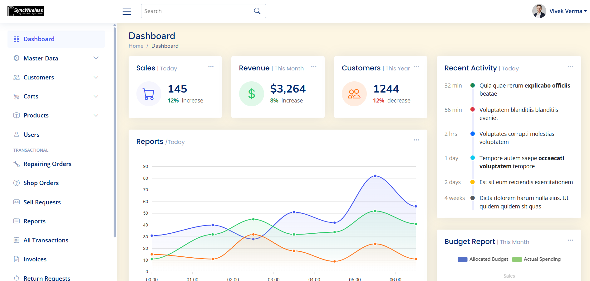
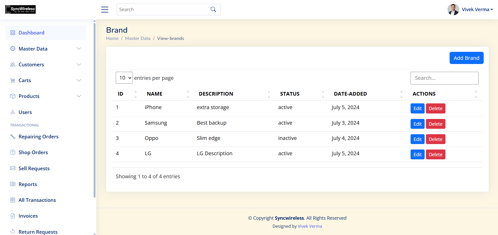

# 📱 SyncWireless

**SyncWireless** is a modern, responsive web application designed to streamline operations for wireless service providers. It provides tools for managing sales, repairs, inventory, orders, and customers in one intuitive dashboard.

---

## ✨ Features

- **📊 Dashboard Analytics** — Real-time insights on revenue, sales, and customer trends.
- **📦 Product & Inventory Management** — Easily manage brands, products, and stock levels.
- **🔧 Repair Orders** — Track and manage device repair requests.
- **🛒 Carts & Transactions** — Integrated cart system and complete transaction history.
- **👥 User & Role Management** — Manage admin, service center users, and staff.
- **📄 Invoices & Reports** — Generate invoices and access detailed reports.
- **📬 Sell Requests & Returns** — Manage incoming sell requests and customer returns.

---

## 📸 Screenshots

### 🔐 Login Page



### 📊 Dashboard Overview



### 🏷️ Brand Management View



> _(Screenshots are stored in `assets/img/`)_

---

## 🧰 Tech Stack

- **Frontend:** HTML5, CSS3, Bootstrap 4/5, jQuery
- **Backend:** PHP (CodeIgniter Framework)
- **Database:** MySQL / MariaDB
- **Libraries:** Chart.js (for graphs), DataTables

---

## 🛠️ Setup Instructions

### 1. Clone the Repository

```bash
git clone https://github.com/passchanger/SyncWireless.git
cd SyncWireless
```

### 2. Import the Database

- Import `database/syncwireless.sql` into your MySQL DB via phpMyAdmin or CLI.

### 3. Configure Database

Edit the file: `application/config/database.php`

```php
'username' => 'your_db_user',
'password' => 'your_db_password',
'database' => 'syncwireless',
```

### 4. Set Base URL

Edit: `application/config/config.php`

```php
$config['base_url'] = 'http://localhost/SyncWireless/';
```

### 5. Start Your Server

If you're using XAMPP:

- Place the project in `htdocs`
- Run Apache & MySQL
- Visit: [http://localhost/SyncWireless](http://localhost/SyncWireless)

---

## 🗂️ Directory Structure

```
SyncWireless/
├── application/
│   ├── controllers/
│   ├── models/
│   ├── views/
├── assets/
│   ├── css/
│   ├── js/
│   ├── images/
│   └── screenshots/
├── database/
│   └── syncwireless.sql
├── index.php
└── README.md
```

---

## 🔮 Roadmap

- [ ] Role-based Access Control (RBAC)
- [ ] Email Notifications for Repair Status
- [ ] API for mobile app integration
- [ ] Dark Mode support

---

## 👨‍💻 Author

**Vivek Verma**  
📧 [vivek@example.com](mailto:vivek@example.com)  
🌐 [syncwireless.com](http://syncwireless.com)

---

## 📝 License

This project is licensed under the **MIT License**.  
Feel free to use, contribute, and improve!

---

© Copyright **SyncWireless**. All rights reserved.
